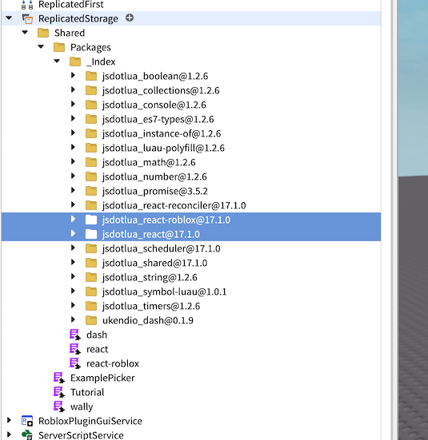

# React in Roblox

This is an unpublished/unfinished copy of a soon to be published "experts article" on using React in Roblox. Enjoy.

## What is React

[React-lua](https://github.com/Roblox/react-lua) is a Roblox compatible lua port of the well known [react.js](https://react.dev/) UI library used in web and mobile ubiquitously.

React-lua is maintained by Roblox and currently several studio plugins and the Roblox universal app (the desktop console and mobile app where you browse for your favorite Roblox games are all written in react-lua.

In addition, we also maintain many libraries that extend or support react-lua. These libraries are often [js-to-lua](https://github.com/Roblox/js-to-lua) transpiled ports of existing well known react.js libraries.

### Why should I use React

Roblox already has plenty of awesome [first class native UI tools](https://create.roblox.com/docs/ui) for building UIs for your experiences. If you're just starting out and your UI consists of just a few static buttons and dialogs, then sticking with just these tools is a great choice!! If you're wanting to apply more structure to the ever growing complexity of your UI or just looking to learn something new, consider trying out react! 

React is an industry standard for many web and mobile apps these days and modern react has never been easier to use. It will certainly be a top choice for any professional developer with prior web development experience.

### Who is this guide for?

This guide is for experienced off-platform react devs looking to build UIs on Roblox and also for existing Roblox devs looking to up-level their UI/UX code. This guide assumes you are already familiar with building [UI in Roblox](https://create.roblox.com/docs/ui).

Since react-lua is a port of react, all react resources apply. This guide highlights the key differences and is also a complete guide for those unfamiliar with React. For further reading, we suggest diving into the [official react docs](https://react.dev/reference/react)). There are also docs for [react-lua](https://jsdotlua.github.io/react-lua/).

### Source Code

Source code for all examples are available on github at [react-lua-tutorial-and-storybook](https://github.com/minimapletinytools/react-lua-tutorial-and-storybook). Note that examples in the repository are written in [Luau](https://create.roblox.com/docs/luau) and are fully compatible with untyped Lua code. Type annotations have been omitted from the examples here for simplicity. I still highly recommended that you leverage typed Luau for all your Roblox scripts!

## Getting Started

### Installing the react-lua module in your Roblox project

If you are using Rojo and the Wally package management library <TODO link to other experts article>, react-lua is available on [Wally](https://wally.run/package/jsdotlua/react?version=17.1.0) This is the recommended way to install React.

You can download an .rbxm file that can be imported into an existing project [here](https://github.com/jsdotlua/react-lua/releases/tag/v17.1.0) 

In either case, react-lua will be added to your ReplicatedStorage folder.



### Setting up React

Typical UI development in Roblox usually entails building a tree of [GUIObjects](https://create.roblox.com/docs/reference/engine/classes/GuiObject) inside the [StarterGui](https://create.roblox.com/docs/reference/engine/classes/StarterGui) service.  React-lua is an entirely code driven UI workflow so instead, we define a single entry point inside [StarterPlayer > StarterPlayerScripts](asses/StarterPlayerScripts)


After following the installation steps above, you should be able to import the React module script. Note that the package names may have different casing depending on which installation method you chose.

```lua
local ReplicatedStorage = game:GetService("ReplicatedStorage")
local React = require(ReplicatedStorage.Shared.Packages.react)
local ReactRoblox = require(ReplicatedStorage.Shared.Packages:FindFirstChild("react-roblox"))
```

### MyTestFrame

First let's define a very basic UI element to test that everything works:

```lua
local function MyTestFrame() 
	return React.createElement("Frame", {
		Size = UDim2.new(0,100,0,100),
	})
end
```

To actually render the UI element, we need to "mount" the react "component tree"

```lua
local handle = Instance.new("ScreenGui",Players.LocalPlayer.PlayerGui)
local root = ReactRoblox.createRoot(handle)
root:render(React.createElement(MyTestFrame, {}, {}))
```

Hit "Play" to see that everything works as expected!


The `render` function is ultimately what converts your React tree into something you can see on screen. The `render` function call will be omitted in the rest of the exampes in this article.

#### What's happening here?

Just like react.js, react-lua internally stores a "tree" representing your UI.
`React.createElement("Frame", {...}, {...})` defines a node in the tree.

- The first argument in this case is the GUIObject that the node represents. It could also be user-defined react component or function
- The second argument is a list of *properties* that modify the appearance or behavior of the GUIObject
- The final argument is a list of children nodes 

Once the tree is defined, `MyTestFrame` in the example above, we need to "mount" so that it will ultimately render a Roblox UI for us. This means converting it into a GUIObject tree in the datamodel. When calling `root:render` with our component, react-lua will do the following things:

- Construct or update it's internal representation of the UI tree.
- Derive the state of each component in the tree.
- Construct or update the matching Roblox GUIObject representation of the UI (rendering). You can see the tree in the explorer widget in the screenshot above.

The flow is identical to the the [component-lifecycle](https://legacy.reactjs.org/docs/react-component.html) of react.

### Styling

React properties are matched to GUIObject styling properties by. For example, to create a crownflower blue 108x108 square in the center of the screen, we want to set the [Size](https://create.roblox.com/docs/reference/engine/classes/GuiObject#Size), [Position](https://create.roblox.com/docs/reference/engine/classes/GuiObject#Position), [AnchorPoint](https://create.roblox.com/docs/reference/engine/classes/GuiObject#AnchorPoint) and [BackgroundColor3](https://create.roblox.com/docs/reference/engine/classes/GuiObject#BackgroundColor3) property.


### Component Trees

Of course you can't have a cute frame without rounded corners! The third argument in `React.createElement` is for child elements. These will be children both in the React tree and the represented datamodel tree. Since Roblox uses child objects like [UICorner]() to style they parent GUIObjects, we just need to instantiate a `UICorner` child element to round out the corners of the parent Frame! 


```lua
local function MyMostCuteTestFrame() 
	return React.createElement("Frame", {
		Position = UDim2.new(0.5,0,0.5,0),
		AnchorPoint = Vector2.new(0.5,0.5),
		Size = UDim2.new(0,100,0,100),
		BackgroundColor3 = Color3.fromRGB(193,179,142)
	}, {
		React.createElement("UICorner", {
			CornerRadius = UDim.new(0,30)
		}),
	})
end
```

Building component _trees_ are a key concept of React so you should get comfortable with it!

The React styling property always match the instance property name you are trying to set. Only styling related properties can be set this way. Please see the "Advanced Styling" section below for more examples!

### Properties

In addition to built in properties like the styling properties above, you can also define custom properties for your custom React components. 

```lua
local function MyCustomTextLabel(props)
	return React.createElement("TextLabel", {
		Size = UDim2.new(0,100,0,100),
		BackgroundColor3 = Color3.fromRGB(193,179,142),
		TextColor3 = Color3.fromRGB(127,127,255),
		Text = props.MyText,
	})
end
```

Now you can instantiate your `MyCustomTextLabel` with whatever text you want!

```lua
root:render(React.createElement(MyCustomTextLabel, { MyText = "I love Giraffes!" }, {}))
```


### Reusing Components

Properties can be used for just about anything including styling properties, text to display, callbacks (see next example) and even React components!

```lua
local function MyCustomFrame(props)
	return React.createElement("Frame", {
		Size = UDim2.new(0,100,0,100),
		BackgroundColor3 = Color3.fromRGB(193,179,142),
	}, { Child = props.child })
end

local function MyCustomFrameWithContents()
	return React.createElement(MyCustomFrame, {
		child = React.createElement("TextLabel", {
			Text = "Hello from inside the frame!",
			BackgroundTransparency = 1,
			AutomaticSize = Enum.AutomaticSize.XY,
		})
	})
end
```

Note that we're using our own `MyCustomFrame` component inside the `MyCustomFrameWithContents` component! The above is a very basic example of how you might build your own reuseable components.

### Interacting

React can listen to events from the Roblox objects it represents.  For example, to do something when a button is activated, we want to listen to the [Activated](https://create.roblox.com/docs/reference/engine/classes/GuiButton#Activated) event.

```lua
local function MyBasicButton()
	return React.createElement("TextButton", {
		Size = UDim2.new(0,100,0,100),
		BackgroundColor3 = Color3.fromRGB(0,255,0),
		Text = "Click me!",
		[React.Event.MouseButton1Click] = function()
			print("You clicked me!")
		end
	})
end
```


[Property change events](https://create.roblox.com/docs/reference/engine/classes/Instance#GetPropertyChangedSignal) are handled separately with the `React.Change` key, for example to listen to changes in the [CanvasPosition](https://create.roblox.com/docs/reference/engine/classes/ScrollingFrame#CanvasPosition) property of a [ScrollingFrame](https://create.roblox.com/docs/reference/engine/classes/ScrollingFrame):

```lua
local function ColorfulScrollingFrame()
	return React.createElement("ScrollingFrame", {
		Size = UDim2.new(0,200,0,200),
		BackgroundColor3 = Color3.fromRGB(255,255,255),
		[React.Change.CanvasPosition] = function(instance: ScrollingFrame)
			print("you scrolled me to " .. tostring(instance.CanvasPosition))
		end
	}, {
		React.createElement("UIListLayout", {
			FillDirection = Enum.FillDirection.Vertical,
		}),
		React.createElement("Frame", {
			Size = UDim2.new(0,200,0,150),
			BackgroundColor3 = Color3.fromRGB(255,0,0),
		}),
		React.createElement("Frame", {
			Size = UDim2.new(0,200,0,150),
			BackgroundColor3 = Color3.fromRGB(0,255,0),
		}),
		React.createElement("Frame", {
			Size = UDim2.new(0,200,0,150),
			BackgroundColor3 = Color3.fromRGB(0,0,255),
		}),
	})
end
```

A common pattern is to pass in a _callback_ as a property to the React component so that information can be passed up the hierarchy.

```lua
local function MyClickableButton(props)
	return React.createElement("TextButton", {
		Size = UDim2.new(0,100,0,100),
		BackgroundColor3 = Color3.fromRGB(0,0,255),
		Text = props.Text,
		[React.Event.MouseButton1Click] = function()
			props.OnClick(tostring(os.date("%x %X")))
		end
	})
end
...

root:render(React.createElement(Tutorial.MyClickableButton, { 
	OnClick = function(time: string) 
		print("Clickaroo! It is " .. time) 
	end 
}))
```

### Connecting with your Game 

You can pass data into your React UI using properties when you call `root:render`. We saw a simple example of this earlier with `MyCustomTextLabel` and for a game it might look something like:

```lua
root:render(React.createElement(SnackTime, { 
	NumPlayers = #game:GetService("Players"):GetPlayers(),
	PetsEnabled = true,
	GameMode = "Fruits & Vegetables"
}, {}))
```

If you need to update the properties, you can just call `root:render` again. To pull bring UI intercations back to your game, you will use events as outlined in the previous section. A common pattern is to pass in callback as a proprety which allows you to separate your UI code and your "side-effecting" game logic. We saw this in the `MyClickableButton` example, 

Using properties is just one option. Another option is fetching the data directly inside of a `useEffect` call or connecting to signals. We will learn more about this in the "Effects" section.

### Inspecting and Debugging your React GUI

React ultimately renders a GUIObject tree in the Roblox [DataModel](https://create.roblox.com/docs/reference/engine/classes/DataModel). You can inspect this tree by finding it in the explorer widget. It will show up under `Players > [Local Player Name] > PlayerGui`. In the `MyCuteTestFrame` example, we can see react-lua has created a "Frame" instance for us and carried over all our desired styling properties.


You can also update this tree in the properties widget, however changes here are only for testing and will likely be overridden the next time react-lua rerenders its component tree.

## 🌶️ Spicing things Up 🌶️

### State `useState`

To build dynamic UIs, you will need components with states that change from user interaction. This can be accomplished with the [useState](https://react.dev/reference/react/useState) hook:

```lua
local function MyColorfulClickableSquare()
    local color, setColor = React.useState(Color3.new(255,255,255))
    return React.createElement("TextButton", {
        Size = UDim2.new(0,200,0,200),
        BackgroundColor3 = color,
		TextXAlignment = Enum.TextXAlignment.Center,
		TextYAlignment = Enum.TextYAlignment.Center,
		Text = "Click me to change color!",
		[React.Event.Activated] = function() 
			local newColor = Color3.fromRGB(math.random(0,255), math.random(0,255), math.random(0,255))
			print("changing color to " .. tostring(newColor) .. "!")
			setColor(newColor)
		end
    })
end
```

The `useState` function takes an initial value and returns the state value and a setter. The `color` state value is assigned to the `BackgroundColor3` property and we call `setColor` inside the `[React.Event.Activated]` event to set its value.

React carefully manages its component state so you must set the state through the state setter function returned by `useState`. Just setting the `color` variable directly in the above example won't persist the state!

Note, if you capture the state value in a lambda (say), it will become stale when the setter gets called. The state value is just a regular lua variable and will not automatically update after it's been captured. To fix this, you will need to capture it within hooks like `useMemo` or `useCallback` and add the state variable to the list of dependencies. See the "Understanding Dependencies" section below.

Ok, let's take it a step further and compose with `MyClickableButton` that we defined earlier.

```lua
local function MyCounter()
	local count, setCount = React.useState(0)

	return React.createElement("Frame", {
		Size = UDim2.new(0,100,0,200),
	}, {
		Layout = React.createElement("UIListLayout", {
			FillDirection = Enum.FillDirection.Vertical,
		}),
		Label = React.createElement("TextLabel", {
			Size = UDim2.new(0,100,0,100),
			BackgroundColor3 = Color3.fromRGB(0,255,0),
			LayoutOrder = 1,
			Text = "I've been clicked " .. tostring(count) .. " times"
		}),
		Button = React.createElement(MyClickableButton, {
			Size = UDim2.new(0,100,0,100),
			Text = "Click me to increment!",
			LayoutOrder = 2,
			OnClick = function()
				setCount(count + 1)
			end
		})
	})
end
```

### Effects `useEffect`

Ultimately, your react-lua UI code will need to connect to the world outside of the react component tree. The `useEffect` hook allows your to run effectful code in a controlled way. The `useEffect` allows you to do just this.

```lua
local function MyClock()
	local text, setText = React.useState("")
	React.useEffect(function()
		print("connecting to Heartbeat")
		local timer = game:GetService("RunService").Heartbeat:Connect(function()
			setText(os.date("%x %X"))
		end)
		return function()
			print("disconnecting")
			timer:Disconnect()
		end
	end, {})
	return React.createElement("TextLabel", {
		Size = UDim2.new(0,200,0,200),
		Text = text,
	})
end
```


The function pass into `useEffect` will get run once (and only once) when the node first gets created in the react tree. Here we connect to the [`Heartbeat`](https://create.roblox.com/docs/reference/engine/classes/RunService#Heartbeat) event of [RunService](https://create.roblox.com/docs/reference/engine/classes/RunService) inside the `useEffect` hook to update `text` to the current time each frame. When we destroy this component (for example, if it's part of a UI dialog we just closed) we no longer want to be connected to this event. The method we pass into the `useEffect` hook allows you to optionally return a cleanup routine. So we return a function that calls the [`Disconnect`](https://create.roblox.com/docs/en-us/reference/engine/datatypes/RBXScriptConnection#Disconnect) method of the [`RBXScriptConnection`](https://create.roblox.com/docs/reference/engine/datatypes/RBXScriptConnection) object that is returned by the `Connect` method.

Another common event you might want to listen to is the [`InputEnded`](https://create.roblox.com/docs/reference/engine/classes/UserInputService#InputEnded) event of [`UserInputService`](https://create.roblox.com/docs/reference/engine/classes/UserInputService) which will allow you to capture keyboard input.

```lua
React.useEffect(function()
		print("connecting to keyboard signal")
		local UserInputService = game:GetService("UserInputService")
		local signal: RBXScriptConnection = UserInputService.InputEnded:Connect(function(input: InputObject, gameProcessedEvent: boolean)
			if input.UserInputType == Enum.UserInputType.Keyboard then
				setText("last key pressed: " .. UserInputService:GetStringForKeyCode(input.KeyCode))
			end
		end)
		return function()
			print("disconnecting from keyboard signal")
			signal:Disconnect()
		end
	end, {}) -- empty dependency array means this effect only runs once
```

Now you might ask, why do I need to wrap code around `useEffect`? React is a "declarative" UI model however it's implementation is "imperative". This means your code, which declares how your UI looks/behaves, may be exectude multiple times. The `useEffect` hook precisely allows us to execute "effectful" code within the declarative model.


```lua
local function UnderstandingUseEffectExample()
	local flavor, setFlavor = React.useState("vanilla")
	print("I might get run a lot!")
	React.useEffect(function()
		print("I only run once!")
		setFlavor("guava")
	end, {}) -- don't forget the {}
	return React.createElement("TextLabel", {
		Size = UDim2.new(0,100,0,100),
		BackgroundColor3 = Color3.fromRGB(255,216,1),
		Text = flavor,
	})
end
```

If you run just this example, you'll see "I might get run a lot!" print twice. In more complex react trees, this may get run many many times. Everytime a property or state changes (for example `setFlavor` gets called), react will rerun the code for that component and all of its descendants. This is called a rerender. Each call to `React.createElement` declares a node in the component tree. On rerenders, any node in the tree that shares the same location and type from the last time the tree was rendered will be considered the "same" node in the tree allowing state to be persisted. In this case, `useEffect` only runs the first time the node gets created in the tree. 

Of course, sometimes, your effectful code might be dependent on other parts of your component (for example, fetching a URL that's passed in as a property). In the above example, we pass in `{}` as the second argument to `useEffect` indicating there are no dependencies to the effect thus ensuring the effect only gets run once. The next 2 sections will dive deeper into dependencies.


### Memoization `useMemo`

Whereas effects are intending for controled interactiions with the world outside of react, sometimes, we'd also like to control code execution for optimization reasons. Remember that your functional component code may get run (rendered) many more times than the number of instances of that component in your tree. We can use the `useMemo` hook to cache expensive computations so that they run only once. This technique is called [memoization](https://en.wikipedia.org/wiki/Memoization)

```lua
local function MyEggCounter(props)
	local numberEggs = React.useMemo(function()
		print("Counting eggs! I'm only going to do this once!")
		local numberEggs = 0
		for i = 1, props.numberEggsToCount do
			numberEggs = numberEggs + 1
		end
		return numberEggs
	end, {props.numberEggsToCount})

	return React.createElement("TextLabel", {
		Size = UDim2.new(0,100,0,100),
		BackgroundColor3 = Color3.fromRGB(0,255,0),
		Text = "I counted " .. numberEggs .. " eggs!"
	})
end

...

root:render(React.createElement(Tutorial.MyEggCounter, { 
	numberEggsToCount = 9511245 
}))
```

Superficially, `useMemo` will take a function, run it, and return the value that the function produces. The next time your component node is rendered, it will use the previously computed value! However, the computed `numberEggs` value is dependent on `props.numberEggsToCount`. We pass this argument inside an array to the second argument of `useMemo` which indicates it is a dependency. Now, each time `props.numberEggsToCount` changes (and only when it changes), we will recompute `numberEggs`.

### Understanding Dependencies

While in most cases, you can and should just stick any values captured inside the function passed into `useMemo`, it's still important to understand what's going on here. When a node is rendered, react will store each of the dependencies in the dependency array. On each subsequent render, it will compare the values on the current render and the previous render. If these values are different, then the dependencies have "changed" and the computation or effect will be run again.

Lua has both value types and reference types. In particular, tabels are reference types and modifying a table will not change the reference to the table. Thus the following does not work.

```lua
local function MyBoopMachine()
	local boops, setBoops = React.useState({
		nose = false,
		ears = false,
		tail = false,
	})

	local whatToBoop = React.useMemo(function()
		if not boops.nose then
			return "nose"
		elseif not boops.ears then
			return "ears"
		elseif not boops.tail then
			return "tail"
		else
			return "all booped!"
		end
	end, {boops})

	return React.createElement("TextButton", {
        Size = UDim2.new(0,200,0,200),
        BackgroundColor3 = Color3.fromRGB(255,255,0),
		Text = "boop " .. whatToBoop,
		[React.Event.Activated] = function() 
			boops[whatToBoop] = true -- this will not update the `boops` reference, so `whatToBoop` will not be updated
			setBoops(boops)	
		end
    })
end
```

To fix this issue, we need to rebuild the table 

```lua
[React.Event.Activated] = function() 
	local boopCopy = {
		nose = boops.nose,
		ears = boops.ears,
		tail = boops.tail,
	}
	boopCopy[whatToBoop] = true
	setBoops(boopCopy)
end
```

Table operations like this are very common and often cumbersome to do manually. Instead, you can use the `join` function avaliable in many lua libraies including [Cryo](https://github.com/Roblox/cryo/blob/main/src/Dictionary/join.lua) and [Dash](https://github.com/Roblox/dash/blob/main/src/join.lua) (which are also available on wally).

```lua
local boopCopy = join(boops, { [whatToBoop] = true })
```

If no dependency argument is passed in (i.e. it's `nil`), then the function will be run every time the component code is run. This is almost never what you want to do. 

```lua
local function MyInfiniteLoop()
	local myState, setMyState = React.useState({ content = "every new react developer be like" })
	React.useEffect(function()
		print("I'm stuck in an infinite loop!")
		setMyState({ content = "This is fine" })
	end) -- no explicit {} causes the effect to run every time the component code is executed!
	return React.createElement("TextLabel", {
		Size = UDim2.new(0,100,0,100),
		BackgroundColor3 = Color3.fromRGB(0,255,0),
		Text = myState.content
	})
end
```

In the above example, the `setText` method prompts a state change which prompts react to run the component function again. Since `useEffect` has `nil` dependency, it will run the effect again, calling the `setText` function again, sending your program into an infinite loop.

Note that react can not tell that the state has not actually changed due to tables being compared by reference. Since the state here is a table, it's reference changes each time call `{ content = "This is fine" }`. Lua primitives like numbers and strings are compared by value so using a string directly as the state would not trigger the state change the second time `setMyState({ content = "This is fine" })` is called (but you still shouldn't do it).

### References `useRef` 

The `useRef` hook allows you to create "references" that can be assigned to anything you like in react compatible way. A common use case is to interact with child components. Functional components do not have class methods like the older style of class components. Instead, we can use the `useImperativeHandle` hook to bind a method to the functional component's state modifiers.

```lua
local TextBoxWithSetter = function(props)
	local text, setText = React.useState("")
	-- binds `setText` to a function to the ref that can be called from the parent component
	React.useImperativeHandle(props.innerRef, function()
		return {
			setText = setText
		}
	end, {})
	return React.createElement("TextBox", {
		Size = UDim2.new(0,200,0,200),
		Text = text,
	})
end

-- same as MyClock except uses TextBoxWithSetter
-- this is totally silly and you can see how it might be useful for more complex components
local function MySillyClock()
	local ref = React.createRef()
	React.useEffect(function()
		local timer = game:GetService("RunService").Heartbeat:Connect(function()
			ref.current.setText(os.date("%x %X"))
		end)
		return function()
			timer:Disconnect()
		end
	end, {})
	return React.createElement(TextBoxWithSetter, {
		innerRef = ref
	})
end
```

This is a powerful tool and breaks the uni-directional data flow of the reactive UI paradigm which will make it harder to reason about your code. Accessing the underlying GUIObject that your react tree represents is especially discouraged but sometimes this is necessary to interact with its dynamic properties.

```lua
local function ColorJumper()

	local ref = React.createRef()
	
	React.useEffect(function()
		local timer = game:GetService("RunService").Heartbeat:Connect(function()
			-- ref.current is the ScrollingFrame, it will be nil on the first render because the ref hasn't been set yet
			if ref.current then
				ref.current.CanvasPosition = Vector2.new(0, math.random(0, 800))
			end
			
		end)
		return function()
			timer:Disconnect()
		end
	end, {})

	return React.createElement("ScrollingFrame", {
		Size = UDim2.new(0,200,0,200),
		-- assign the ScrollingFrame instance to ref
		ref = ref
	}, {
		React.createElement("Frame", {
			Size = UDim2.new(1,0,0,200),
			BackgroundColor3 = Color3.fromRGB(255,194,132),
		}),
		React.createElement("Frame", {
			Size = UDim2.new(1,0,0,200),
			Position = UDim2.new(0,0,0,200)
			BackgroundColor3 = Color3.fromRGB(255,251,149),
		}),
		...
	})
end
```


### More Hooks 🎣

All hooks in react are avaliable in react-lua. Please see the [react docs](https://react.dev/reference/react/hooks) for more information.

A common pattern is to define your own custom hooks. 

```lua
local function useToggleState(default: boolean): {
	enabled: boolean,
	enable: () -> (),
	disable: () -> (),
}
	local enabled, setEnabled = React.useState(default)

	local enable = React.useCallback(function()
		setEnabled(true)
	end, {})

	local disable = React.useCallback(function()
		setEnabled(false)
	end, {})

	return {
		enabled = enabled,
		enable = enable,
		disable = disable,
	}
end
```

<sub>thanks [boyned](https://blog.boyned.com/articles/things-i-learned-using-react/) for the example above!</sub>

### Advanced Styling

Styling primitives in react-lua + Roblox are different than the ones used by react-dom or react-native. In particular, Roblox has certain `GUIObjects` that apply styling to their parents. Ones you will want to use frequently include:

- [UIListLayout](https://create.roblox.com/docs/reference/engine/classes/UIListLayout) for applying layouts
- [UICorner](https://create.roblox.com/docs/reference/engine/classes/UICorner) for rounding corners
- [UIPadding](https://create.roblox.com/docs/reference/engine/classes/UIPadding) for padding content
- [UIStroke](https://create.roblox.com/docs/reference/engine/classes/UIStroke) for outlining 

Thus in react-lua, we create a child

```lua
local function MyReallyReallyCuteFrame(props: MyReallyReallyCuteFrameProps)
	return React.createElement("Frame", {
		Size = UDim2.new(0,200,0,200),
		AnchorPoint = Vector2.new(0.5,0.5),
		Position = UDim2.new(0.5,0,0.5,0),
		BackgroundColor3 = Color3.fromRGB(255,194,132),
	}, {
		React.createElement("UIPadding", {
			PaddingTop = UDim.new(0,20),
			PaddingBottom = UDim.new(0,20),
			PaddingLeft = UDim.new(0,20),
			PaddingRight = UDim.new(0,20),
		}),
		React.createElement("UICorner", {
			CornerRadius = UDim.new(0,20)
		}),
		React.createElement("UIStroke", {
			Thickness = 8,
			Color = Color3.fromRGB(255,106,106),
		}),
		Content = React.createElement("Frame", {
			Size = UDim2.new(0,100,0,100),
			BackgroundColor3 = Color3.fromRGB(255,251,149),
		})
	})
end
```


Adding a `UIListLayout` will position all children in order based on their respective sizes. This is super useful for managing layout and it's common to have your UI tree composed of multiple `Frames` with `UIListLayouts`. 

```lua
local function MyLayoutExample()
	return React.createElement("Frame", {
		Size = UDim2.new(0,200,0,400),
	}, {
		React.createElement("UIListLayout", {
			FillDirection = Enum.FillDirection.Vertical,
		}),
		React.createElement("Frame", {
			Size = UDim2.new(1,0,0.5,0),
		}, {
			React.createElement("UIListLayout", {
				FillDirection = Enum.FillDirection.Horizontal,
			}),
			React.createElement("Frame", {
				Size = UDim2.new(0.5,0,1,0),
				BackgroundColor3 = Color3.fromRGB(255,194,132),
			}),
			React.createElement("Frame", {
				Size = UDim2.new(0.5,0,1,0),
				BackgroundColor3 = Color3.fromRGB(194,255,132),
			}),
		}),
		React.createElement("Frame", {
			Size = UDim2.new(1,0,0.5,0),
			BackgroundColor3 = Color3.fromRGB(255,251,149),
		}),
	})
end
```


Note, if you are using explicit non integer table keys, you will also need to set the [`LayoutOrder`](https://create.roblox.com/docs/reference/engine/classes/GuiObject#LayoutOrder) property.

## Class Components

With the latest version of react, class components are discouraged. Functional components are largely simpler and easier to use and are sufficient 99.9% of the time.

Class components may offer some advantages in certain situations. Since the lua does not support native classes, the syntax for declaring class components is as follows:

```lua
local MyComponent = React.Component:extend("MyComponent")

function MyComponent:render()
    return React.createElement("TextLabel", {Text = self.props.text})
end

function MyComponent:componentDidMount()
    print("rendered with text " .. self.props.text .. " by the way, you could have just done this with useEffect")
end
```

Similar, if you want to declare a [PureComponent](https://react.dev/reference/react/PureComponent):

```lua
local MyPureComponent = React.PureComponent:extend("MyPureComponent")
```

## Roact Migration

Some of you may be familiar with [roact](https://roblox.github.io/roact/) which is an earlier manual port of the react programming paradigm. Roact is no longer being maintained and does not support functional components. For the most part, migrating is just a matter of replacing `require(...Roact)` with `require(...React)` will do the trick. See the [react-lua documentation for guidance](https://jsdotlua.github.io/react-lua/migrating-from-legacy/minimum-requirements/) for guidance on items that require more attention.

## Contributing to react-lua

[React-lua](https://github.com/Roblox/react-lua) is currently not accepting direct contributions to react-lua and its supporting libraries yet. This is primarily due to 2 reasons:

- React-lua attempts to closely follow the upstream react.js code and therefore we have strict contribution guidelines that we still need to define
- Our internal CI/CD tools for lua development are not publicly available at this time and therefore changes can not be automatically verified.

This may change in the future as we hope to support a diverse and collaborative open source ecosystem around Roblox!!

To learn more, see our experts article on Lua & Roblox Open Source Ecosystem

## Future Topics

As we make more of libraries and resources available, you'll have access to an increasingly powerful toolkit. We'll be covering the following topics in the near future:

- react component libraries
- writing unit tests
